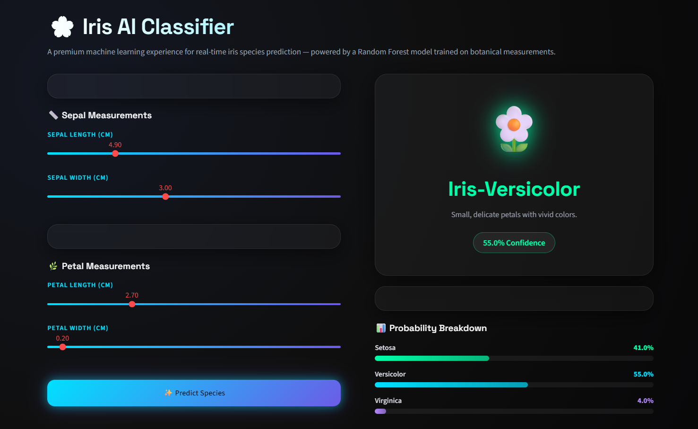

# 🌸 Iris Flower Classification App

A Machine Learning web app that classifies Iris flowers into three species:
- Setosa
- Versicolor
- Virginica

Built using **Python, Scikit-learn, and Streamlit**.

---

## 🚀 Live Demo
👉 https://your-streamlit-app-url.streamlit.app

---

## 📊 Project Overview

This project uses the famous Iris dataset to train a classification model that predicts flower species based on:
- Sepal Length
- Sepal Width
- Petal Length
- Petal Width

---

## 🧠 Machine Learning Model

- Algorithm: Random Forest Classifier
- Library: Scikit-learn
- Accuracy: ~95-100%

---

## 🗂️ Project Structure

Iris-Flower-Classification/
│
├── data/
│ └── Iris.csv
│
├── notebooks/
│ └── iris_analysis.ipynb
│
├── models/
│ └── iris_model.pkl
│
├── app.py
├── train.py
├── requirements.txt
├── README.md

---

## ⚙️ How to Run Locally

### 1. Clone repo

git clone https://github.com/your-username/iris-classification.git
cd iris-classification

### 2. Install dependencies

pip install -r requirements.txt

### 3. Run app

streamlit run app.py

---

## 📦 Requirements

- streamlit
- pandas
- numpy
- scikit-learn
- joblib

---

## 🎯 Features

✔ Simple UI for prediction  
✔ Real-time classification  
✔ Clean ML pipeline  
✔ Interactive sliders  
✔ Instant results  

---

## 📸 UI Preview

---

## 👨‍💻 Author

Built by **Pavnesh Bhatt**

---

## 📌 Note

This project is part of an internship task (Oasis Infobyte)